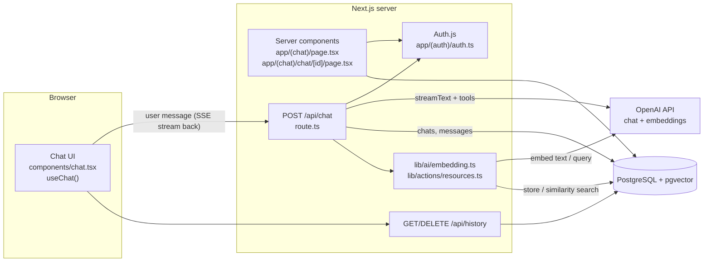
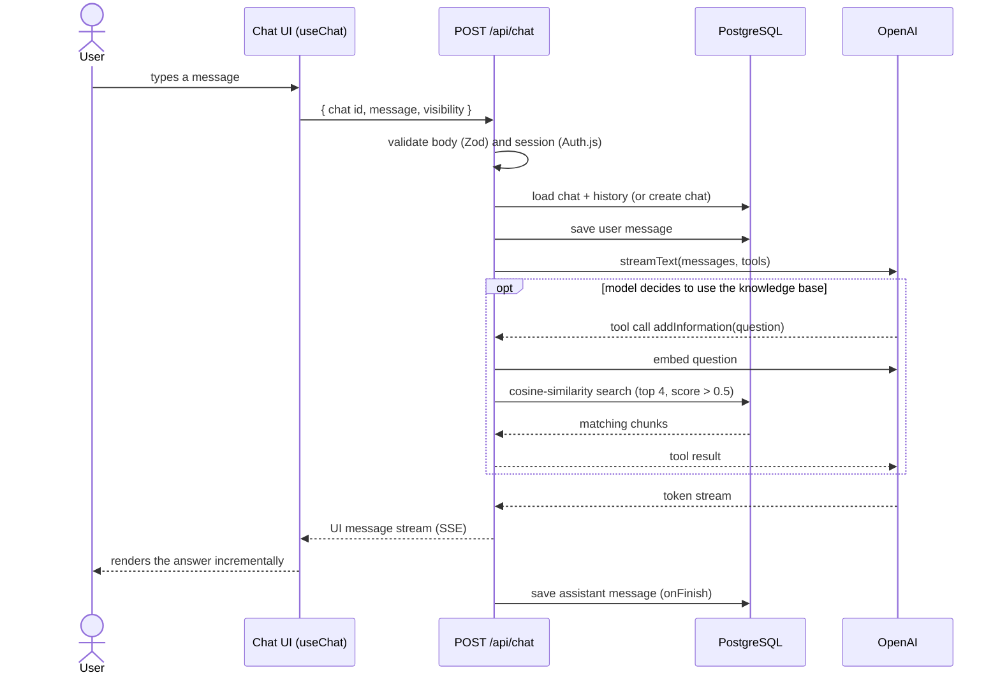
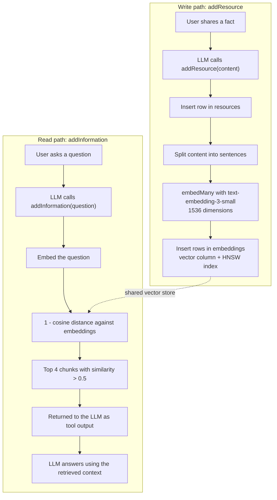
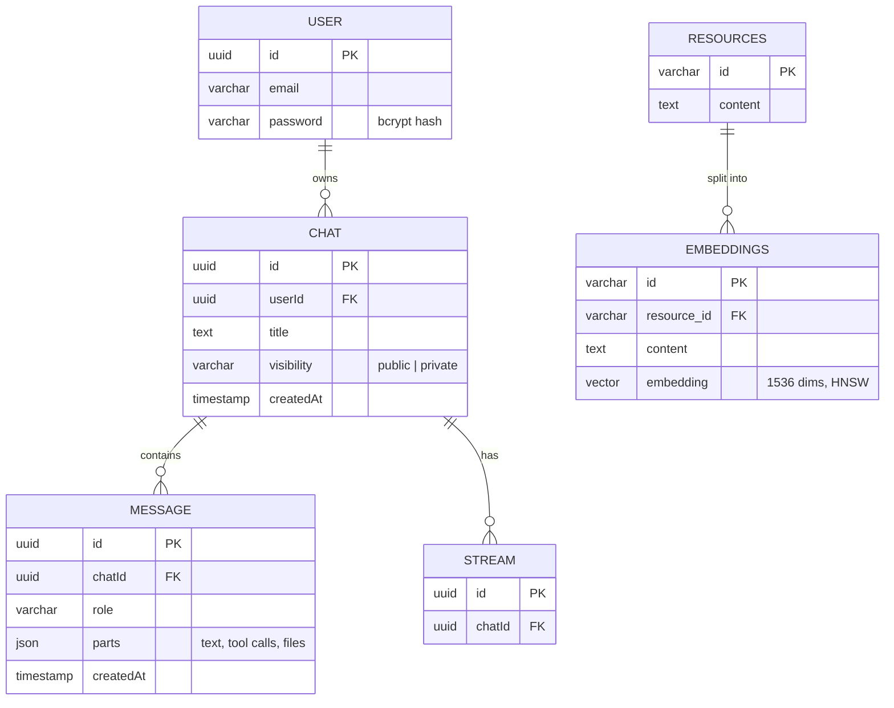

# RAG Chatbot (Next.js, Vercel AI SDK, pgvector)

A full-stack AI chatbot that answers questions from its own **knowledge base**. Users can teach it new facts in plain conversation, and it retrieves them later with vector similarity search (retrieval-augmented generation, RAG). Conversations are persisted per user in PostgreSQL.

It is meant as a compact, readable reference for building a production-style chat application: streaming responses, tool calling, vector search, authentication, and chat history, with no external services beyond PostgreSQL and the OpenAI API.

## Features

- **Streaming chat UI** with markdown rendering, message editing and regeneration, light/dark theme.
- **Tool-calling RAG**: the model decides when to read from or write to the knowledge base.
  - `addResource` stores new knowledge. The text is split into chunks, embedded, and saved.
  - `addInformation` embeds the user's question and returns the closest chunks (cosine similarity).
- **Persistent chats** with a sidebar history, private/public visibility per chat, and deletion.
- **Authentication** with Auth.js: email/password accounts plus one-click guest sessions.
- **Typed end to end**: Zod request validation, Drizzle ORM schema and migrations, typed UI messages and tools.
- **Example tool** (`getWeather`, Open-Meteo, no API key) showing how to define a tool and infer its types.

## Tech stack

| Layer | Technology |
| --- | --- |
| Framework | Next.js 16 (App Router), React 19, TypeScript |
| AI | [Vercel AI SDK](https://ai-sdk.dev) 5 (`streamText`, tools, `useChat`), OpenAI `gpt-5.1` + `text-embedding-3-small` |
| Database | PostgreSQL + [pgvector](https://github.com/pgvector/pgvector) (HNSW index), Drizzle ORM |
| Auth | Auth.js (next-auth v5) credentials provider, bcrypt password hashing |
| UI | Tailwind CSS 4, Radix UI, Framer Motion, Streamdown |

## Architecture



### What happens when a message is sent



### How the knowledge base works



### Data model



## Getting started

### Prerequisites

- Node.js 20+ and [pnpm](https://pnpm.io)
- Docker (or any PostgreSQL instance with the `pgvector` extension available)
- An [OpenAI API key](https://platform.openai.com/api-keys)

### 1. Install dependencies

```bash
pnpm install
```

### 2. Start PostgreSQL with pgvector

```bash
docker run -d --name rag-chatbot-db \
  -e POSTGRES_PASSWORD=postgres \
  -e POSTGRES_DB=ragchat \
  -p 5432:5432 \
  pgvector/pgvector:pg16
```

### 3. Configure the environment

```bash
cp .env.example .env
```

Set `OPENAI_API_KEY` and generate `AUTH_SECRET` with `openssl rand -base64 32`. The default `DATABASE_URL` matches the Docker command above.

### 4. Create the database schema

```bash
pnpm db:migrate
```

The first migration enables the `vector` extension and creates the HNSW index.

### 5. Run the app

```bash
pnpm dev
```

Open [http://localhost:3000](http://localhost:3000). You are signed in as a guest automatically, or you can register an account.

### Try it

1. Tell the bot something: *"Our support hotline is open Monday to Friday, 9 to 17 o'clock."* The model calls `addResource` and stores it.
2. Start a new chat and ask: *"When can I reach the support hotline?"* The model calls `addInformation`, retrieves the stored fact, and answers from it.

## Project structure

```text
app/
  (auth)/             login, register, guest sign-in, Auth.js config
  (chat)/
    page.tsx          new chat
    chat/[id]/        existing chat (loaded from the database)
    api/chat/         POST: stream an answer, DELETE: remove a chat
    api/history/      paginated chat history for the sidebar
components/           chat UI, message rendering, input, sidebar, ui/ primitives
hooks/                scroll, auto-resume, chat visibility
lib/
  ai/embedding.ts     chunking, embeddings, vector similarity search
  ai/tools/           tool definitions (getWeather example)
  actions/            server actions (createResource)
  db/                 Drizzle schema, queries, migrations
  env.mjs             typed, validated environment variables
```

## Adapting it

| Goal | Where to change it |
| --- | --- |
| Change the model or system prompt | `streamText({ model, system })` in `app/(chat)/api/chat/route.ts` |
| Use another provider (Azure OpenAI, Anthropic, ...) | Swap the provider package and model in `route.ts` and `lib/ai/embedding.ts`. If the embedding dimension changes, update `vector(1536)` in `lib/db/schema/embeddings.ts` and generate a new migration. |
| Improve retrieval quality | `generateChunks` (chunking strategy), `limit` and the `0.5` similarity threshold in `lib/ai/embedding.ts` |
| Preload your own documents | Call `createResource({ content })` from a script or a server action, for example to ingest FAQs or product documentation |
| Add a tool | Define it with `tool({ description, inputSchema, execute })` under `lib/ai/tools/`, register it in `streamText({ tools })`, and add its type to `ChatTools` in `lib/types.ts` (`getWeather` is defined but not registered by default) |
| Render tool calls in the UI | Handle `part.type === "tool-<name>"` in `components/message.tsx` |
| Change authentication | `app/(auth)/auth.ts`; add an OAuth provider next to the credentials providers |

## Scripts

| Command | Description |
| --- | --- |
| `pnpm dev` | Start the development server |
| `pnpm build` / `pnpm start` | Production build and server |
| `pnpm db:generate` | Generate a migration from schema changes |
| `pnpm db:migrate` | Apply migrations |
| `pnpm db:studio` | Open Drizzle Studio |

## Limitations

This is a showcase, not a hardened product.

- The model is fixed to OpenAI; there is no model selector.
- Image attachments are validated in the request schema, but the `/api/files/upload` endpoint used by the attach button is not implemented.
- The knowledge base is shared by all users; there is no per-user or per-tenant isolation.
- There is no rate limiting, usage quota, or content moderation.
- Chunking is a simple sentence split.
- Chat titles are the first 60 characters of the first message.

## Acknowledgements

Built on patterns from the open-source [Vercel AI Chatbot](https://github.com/vercel/ai-chatbot) template and the [AI SDK RAG guide](https://ai-sdk.dev/cookbook/guides/rag-chatbot).

## License

Released under the [Apache License 2.0](LICENSE). The project is derived from Apache-2.0 licensed Vercel projects; attribution is in [NOTICE](NOTICE).
